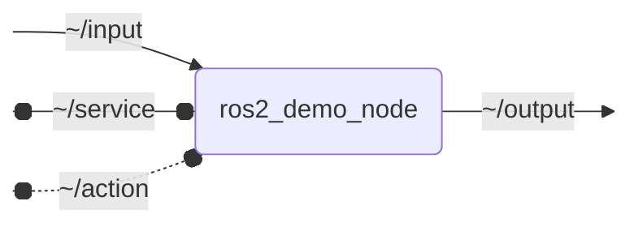

# ros2_demo_repository

<p align="center">
  
  
  <a href="https://github.com/OpenAutomatedDriving/ros2_demo_repository/actions/workflows/docker-ros.yml"></a>
  <a href="https://github.com/OpenAutomatedDriving/ros2_demo_repository/actions/workflows/industrial_ci.yml"></a>
  <a href="https://OpenAutomatedDriving.github.io/ros2_demo_repository"></a>
  
</p>

**Demo repository for an OpenADS module**

This repository serves as a demo for an OpenADS module, showcasing the structure and documentation style for OpenADS packages. It includes a simple ROS 2 node that subscribes to a topic, processes the data, and publishes the result. This is a short description of the repository and its purpose.

> [!IMPORTANT]  
> This repository is part of [🚗 ***OpenADS***](https://github.com/OpenAutomatedDriving), the *Open Automated Driving Stack*.

## 📋 Table of Contents

- [🚀 Quick Start](#quick-start)
- [🧑‍💻 Development](#development)
- [📦 Package Documentation](#package-documentation)
- [🔍 Implementation Details](#implementation-details)
- [🙏 Acknowledgements](#acknowledgements)


## 🚀 Quick Start

1. Start a container of the pre-built runtime image.
    ```bash
    docker run --rm -it ghcr.io/openautomateddriving/ros2_demo_repository:latest bash
    ```
1. Inside the container, launch the pre-built nodes.
    ```bash
    ros2 launch ros2_demo_package ros2_demo_node_launch.py
    ```

## 🧑‍💻 Development

### Set up Development Environment

1. Clone the repository.
    ```bash
    git clone https://github.com/OpenAutomatedDriving/ros2_demo_repository.git
    ```
1. Initialize the [`.dev-environment`](https://github.com/OpenAutomatedDriving/dev-environment) submodule containing development environment configuration.
    ```bash
    cd ros2_demo_repository
    git submodule update --init --recursive
    ```
1. Open the repository in [Visual Studio Code](https://code.visualstudio.com).
    ```bash
    code .
    ```
1. Install the recommended VS Code extensions.  
    > *Ctrl+Shift+P / Extensions: Show Recommended Extensions / Install Workspace Recommended Extensions (Cloud Download Icon)*
1. Reopen the repository in a [Dev Container](https://code.visualstudio.com/docs/devcontainers/containers).
    > *Ctrl+Shift+P / Dev Containers: Rebuild and Reopen in Container*

### Build

> *Ctrl+Shift+B*

or

```bash
colcon build
```

### Run Tests

> *Ctrl+Shift+P / Tasks: Run Test Task*

or

```bash
colcon build --cmake-args -DCMAKE_EXPORT_COMPILE_COMMANDS=1
colcon test
colcon test-result --verbose
```


## 📦 Package Documentation

[*Source Code Documentation*](https://openautomateddriving.github.io/ros2_demo_repository)

### `ros2_demo_package`

#### Launch Files

##### [`ros2_demo_node_launch.py`](ros2_demo_package/launch/ros2_demo_node_launch.py)

| Argument | Default | Description |
| --- | --- | --- |
| `input_topic` | `"~/input"` |  |
| `output_topic` | `"~/output"` |  |
| `name` | `"ros2_demo_node"` | node name |
| `namespace` | `""` | node namespace |
| `params` | `os.path.join(get_package_share_directory("ros2_demo_package"), "config", "params.yml")` | path to parameter file |
| `log_level` | `"info"` | ROS logging level (debug, info, warn, error, fatal) |
| `use_sim_time` | `"false"` | use simulation clock |

#### `ros2_demo_node`



##### Subscribed Topics

| Topic | Type | Description |
| --- | --- | --- |
| `~/input` | `geometry_msgs/msg/PointStamped` | |

##### Published Topics

| Topic | Type | Description |
| --- | --- | --- |
| `~/output` | `geometry_msgs/msg/PointStamped` | |

##### Service Servers

| Service | Type | Description |
| --- | --- | --- |
| `~/service` | `std_srvs/srv/SetBool` | |

##### Action Servers

| Action | Type | Description |
| --- | --- | --- |
| `~/action` | `ros2_demo_package_interfaces/action/Fibonacci` | |

##### Parameters

| Parameter | Type | Default | Description |
| --- | --- | --- | --- |
| `param` | `float` | `1.0` | TODO |

### `ros2_demo_package_interfaces`

#### Actions

| Type | Description |
| --- | --- |
| [`ros2_demo_package_interfaces/action/Fibonacci`](ros2_demo_package_interfaces/action/Fibonacci.action) | |


## 🔍 Implementation Details

TODO: provide on Doxygen developer documentation page?


## 🙏 Acknowledgements

This work is accomplished within the projects TODO (FKZ TODO). We acknowledge the financial support by the 🇩🇪 Federal Ministry of Research, Technology and Space (BMFTR).
