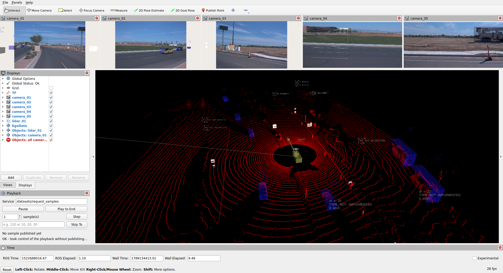
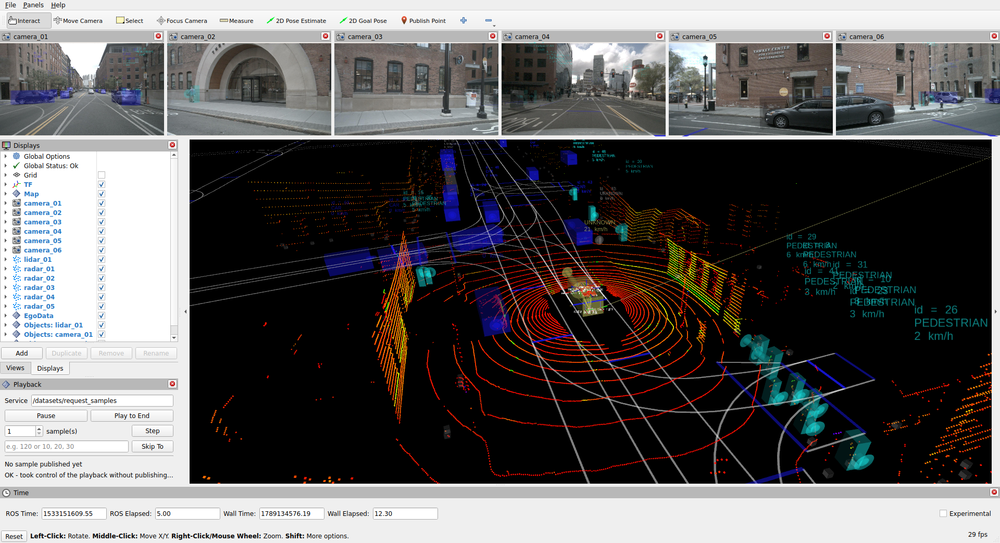
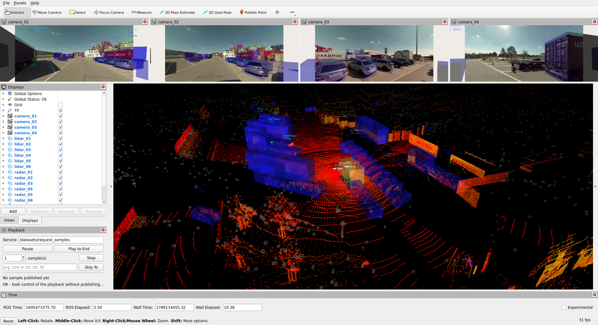
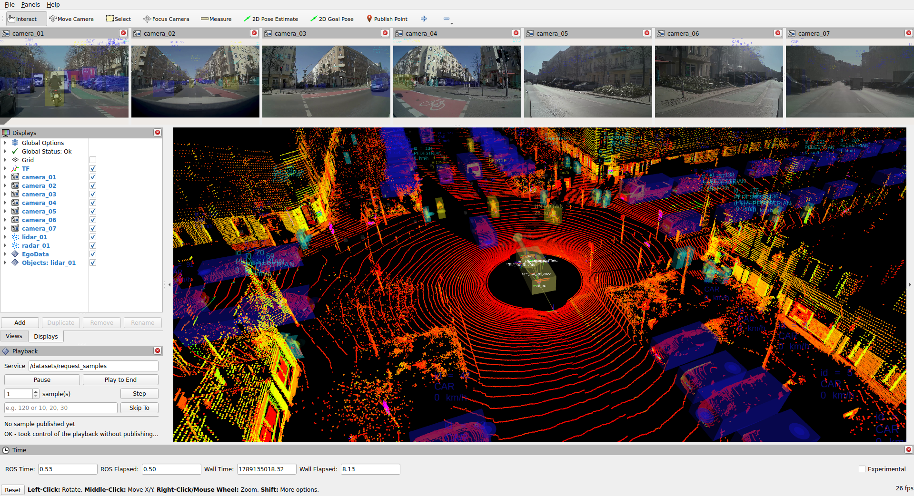
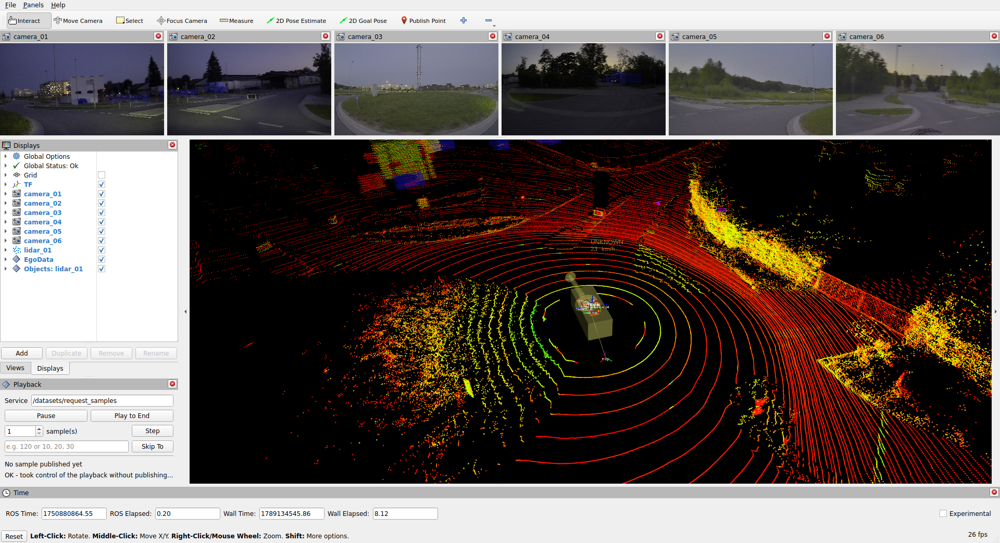
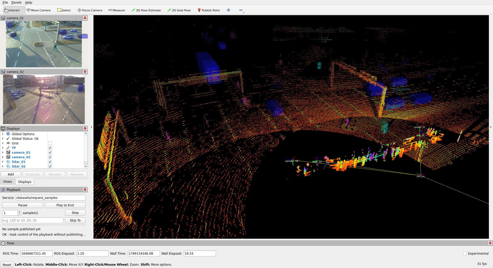

# autonomy_datasets

<p align="center">
  <a href="https://www.ros.org"></a>
  <a href="https://github.com/thinking-cars/autonomy_datasets/releases/latest"></a>
  <a href="https://github.com/thinking-cars/autonomy_datasets/blob/main/LICENSE"></a>
  <br>
  <a href="https://github.com/thinking-cars/autonomy_datasets/actions/workflows/docker-ros.yml"></a>
  <a href="https://github.com/thinking-cars/autonomy_datasets/actions/workflows/compose-oci.yml"></a>
  <a href="https://github.com/thinking-cars/autonomy_datasets/actions/workflows/helm-oci.yml"></a>
  <a href="https://thinking-cars.github.io/autonomy_datasets"></a>
  <a href="https://github.com/thinking-cars/autonomy_datasets/actions/workflows/consistency.yml"></a>
</p>

> This repository will be part of the **Autonomy.Hub Ecosystem**

As part of the Autonomy.Hub Ecosystem, **Autonomy.Datasets** enables the Automated Driving community to easily test their automated driving building blocks across different datasets:

- 🔄 **Unified ROS 2 Interface**: Work with multiple datasets using the benefits of the ROS 2 ecosystem
- 📊 **Comprehensive Benchmarks**: Use the provided datasets with [Autonomy.Benchmarks](https://github.com/thinking-cars/autonomy_benchmarks) to benchmark building blocks across different automated driving tasks
- ⚡ **Efficient Data Pipeline**: Preprocessed Rosbag files ensure fast execution during development
- 🐳 **Dockerized Environment**: Reproducible setup with all dependencies included
- 🔌 **Modular Architecture**: Easy integration with other ROS 2 packages

## Supported Datasets

This repository supports various automated driving datasets.

> [**Contributions**](docs/IMPLEMENTATION.md#adding-a-new-dataset) adding more datasets are welcome

| Dataset | Release | Countries | Samples | Preview |
|-------- | ------- | --------- | ------- | ------ |
| [**Waymo Open Dataset**](docs/IMPLEMENTATION.md#waymo-open-dataset) | August 2019 | United States | 158.081 Training</br>39.987 Validation |  |
| [**nuScenes**](docs/IMPLEMENTATION.md#nuscenes-dataset) | March 2019 | United States (Boston), Singapore | 28.130 Training</br>6.019 Validation |  |
| [**MAN TruckScenes**](docs/IMPLEMENTATION.md#man-truckscenes-dataset) | July 2024 | Germany | 747 scenes of 20 seconds each, annotated at 2 Hz with 6 lidars, 6 radars and 4 cameras |  |
| [**NVIDIA Physical AI AV Dataset (Alpamayo)**](docs/IMPLEMENTATION.md#nvidia-physicalai-av-dataset) | October 2025 | United States, Germany, France, Italy, Sweden, Spain, Portugal, Greece, Austria, Finland, Croatia, Netherlands, Denmark, Slovenia, Estonia, Slovakia, Belgium, Czechia, Lithuania, Poland, Romania, Luxembourg, Latvia, Hungary, Bulgaria | approx. 17.016.400 samples from 85.082 clips, each 20 seconds (10 Hz) with 1 lidar, 7 cameras and up to 10 radars |  |
| [**DrivIng**](docs/IMPLEMENTATION.md#driving-dataset) | January 2026 | Germany (Ingolstadt) | 3 sequences (day, dusk, night) at 10 Hz with 1 lidar and 6 cameras |  |
| [**TUM Traffic**](docs/IMPLEMENTATION.md#tum-traffic-dataset) | April 2022 | Germany (A9 motorway and S110 intersection near Munich) | Roadside infrastructure subsets (releases `R00` to `R02`) with up to 4 cameras and 2 lidars per sensor station |  |
| [**Zenseact Open Dataset**](docs/IMPLEMENTATION.md#zenseact-open-dataset) | May 2023 | 14 European countries (Sweden, Germany, Poland, Italy, ...) | 100.000 annotated frames, 1.473 sequences of 20 seconds and 29 drives of a few minutes, each at 10 Hz with 3 lidars and 1 camera | *preview pending: `docs/assets/rviz_zenseact_open_dataset.png`* |

<p align="center">
  <strong>🚀 <a href="#-quick-start">Quick Start</a></strong> • <strong>💻 <a href="#-development">Development</a></strong> • <strong>📝 <a href="#-documentation">Documentation</a></strong>
</p>


## 🚀 Quick Start

The `autonomy_datasets` package is available in a pre-compiled Docker image. Start a container mounting your local dataset directory. Alternatively, use VS Code to open this repository in a Devcontainer.

> Follow the instructions in the [Supported Datasets](./docs/IMPLEMENTATION.md) section to obtain the dataset.

```bash
xhost +local:  # allow graphical output for RViz visualization
DATASET_DIR="$HOME/datasets"  # adapt this to your dataset location
docker run --rm -it --gpus all --env=DISPLAY --volume=/tmp/.X11-unix:/tmp/.X11-unix:rw --volume $DATASET_DIR:/datasets ghcr.io/thinking-cars/autonomy_datasets:latest bash
```

Run the following command in the container to visualize samples from the *NVIDIA PhysicalAI AV Dataset*:

```bash
hf auth login  # login with your HuggingFace account
ros2 launch autonomy_datasets autonomy_datasets.launch.py
```

This will download all selected scenes sequentially, write samples into Rosbags at `$DATASET_DIR/nvidia_physicalai_av_dataset/bags/<version>` while visualizing samples in Rviz. Rosbags are stored in a subfolder named after the version of the dataset conversion. Existing Rosbags of the current version are replayed instead of being generated again; a new version generates its Rosbags into its own subfolder.

## 💻 Development

### Set up Development Environment

1. Clone the repository.
    ```bash
    git clone https://github.com/thinking-cars/autonomy_datasets.git
    ```
1. Initialize the [`.openads-dev-environment`](https://github.com/openads-project/openads-dev-environment) submodule containing development environment configuration.
    ```bash
    cd autonomy_datasets
    git submodule update --init --recursive
    ```
1. Open the repository in [Visual Studio Code](https://code.visualstudio.com).
    ```bash
    code .
    ```
1. Install the recommended VS Code extensions.
    > *Ctrl+Shift+P / Extensions: Show Recommended Extensions / Install Workspace Recommended Extensions (Cloud Download Icon)*
1. Reopen the repository in a [Dev Container](https://code.visualstudio.com/docs/devcontainers/containers).
    > *Ctrl+Shift+P / Dev Containers: Rebuild and Reopen in Container*

### Build

> *Ctrl+Shift+B*

```bash
colcon build
```

### Run Tests

> *Ctrl+Shift+P / Tasks: Run Test Task*

```bash
colcon build --cmake-args -DCMAKE_EXPORT_COMPILE_COMMANDS=1
colcon test
colcon test-result --verbose
```


## 📝 Documentation

Package and node interfaces are documented in the respective package READMEs listed below. Implementation details are found in the [Source Code Documentation](https://thinking-cars.github.io/autonomy_datasets).

| Package | Description |
| --- | --- |
| [autonomy_datasets](autonomy_datasets/README.md) | Integrates automated driving datasets into the ROS 2 ecosystem |
| [autonomy_datasets_msgs](autonomy_datasets_msgs/README.md) | Message definitions for dataset meta information that has no representation in perception_msgs |

## ⚖️ Licensing

The source code in this repository is licensed under Apache-2.0, see [LICENSE](LICENSE). Container images provided by this repository may contain third-party software shipped with their own license terms.

> **⚠️ IMPORTANT DATASET LICENSE DISCLAIMER**
> 
> This repository provides tools and interfaces for working with autonomous driving datasets. **The actual datasets (nuScenes, Waymo Open Dataset, etc.) are NOT included and must be obtained separately.**
>
> **Before using any dataset, you MUST:**
> - Register and accept the terms of use for each dataset you wish to use
> - Download the datasets from their official sources
> - Comply with all licensing terms and conditions of the respective dataset providers
>
> **Dataset-specific requirements:**
> - **nuScenes**: Register at [nuScenes.org](https://www.nuscenes.org/nuscenes) and agree to the [nuScenes Terms of Use](https://www.nuscenes.org/terms-of-use)
> - **Waymo Open Dataset**: Register at [Waymo Open Dataset](https://waymo.com/open) and agree to their [License Agreement](https://waymo.com/open/terms)
> - **NVIDIA Physical AI Autonomous Vehicles Dataset**: Register at [HuggingFace](https://huggingface.co/datasets/nvidia/PhysicalAI-Autonomous-Vehicles) and agree to the [NVIDIA Autonomous Vehicles Dataset License Agreement](https://huggingface.co/datasets/nvidia/PhysicalAI-Autonomous-Vehicles/blob/main/LICENSE.pdf)
> - **DrivIng**: Downloaded automatically from [Harvard Dataverse](https://doi.org/10.7910/DVN/VBZKDY); usage is subject to [CC BY-NC-ND 4.0](https://creativecommons.org/licenses/by-nc-nd/4.0/)
> - **MAN TruckScenes**: Downloaded automatically from the [AWS Open Data registry](https://registry.opendata.aws/man-truckscenes/); usage is subject to [CC BY-NC-SA 4.0](https://creativecommons.org/licenses/by-nc-sa/4.0/)
> - **TUM Traffic**: Register at [a9-dataset.innovation-mobility.com](https://a9-dataset.innovation-mobility.com/en/register), agree to the [license](https://a9-dataset.innovation-mobility.com/license), and [download](https://a9-dataset.innovation-mobility.com/downloads) the archives manually; usage is subject to [CC BY-NC-ND 4.0](https://creativecommons.org/licenses/by-nc-nd/4.0/)
> - **Zenseact Open Dataset**: [Apply for access](https://zod.zenseact.com) to receive a personal download link, which the adapter uses to download the dataset; usage is subject to [CC BY-SA 4.0](https://creativecommons.org/licenses/by-sa/4.0/) and the dataset is not intended for military use

## 🙏 Acknowledgements

This project is maintained by [Thinking Cars](https://thinking-cars.de). We appreciate contributions and are happy to discuss potential collaborations.
