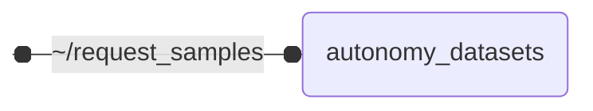

# `autonomy_datasets`

Integrates automated driving datasets into the ROS 2 ecosystem

## Nodes

### `autonomy_datasets`

Samples are published as fast as the playback advances until the first request is received on the
`request_samples` service. From then on, playback is controlled by the requesting node, e.g. by a
benchmark that evaluates every sample it receives: samples are only published while a request is
being processed, and a request is answered once its samples have been published. Start the node
with `start_paused:=true` to publish no sample before the first request.

Samples are identified by their position within the playback pass, starting at 0. Since playback
cannot rewind, requested samples that have already been passed are reported as not published.

```bash
# publish the next sample and wait until it has been published
ros2 service call /datasets/request_samples autonomy_datasets_msgs/srv/RequestSamples "{mode: 1, num_samples: 1}"

# publish selected samples, skipping all samples in between
ros2 service call /datasets/request_samples autonomy_datasets_msgs/srv/RequestSamples "{mode: 2, sample_ids: [10, 12, 15]}"

# publish all remaining samples and wait for the end of the dataset
ros2 service call /datasets/request_samples autonomy_datasets_msgs/srv/RequestSamples "{mode: 0}"
```



#### Service Servers

| Service | Type | Description |
| --- | --- | --- |
| `~/request_samples` | `autonomy_datasets_msgs/srv/RequestSamples` | publish samples of the dataset on request, answered once the requested samples have been published |

#### Parameters

| Parameter | Type | Default | Description |
| --- | --- | --- | --- |
| `datasets_path` | `string` | `/datasets` | path to datasets directory |
| `dataset` | `string` | `waymo_open_dataset` | name of the dataset to use |
| `dataset_split` | `string` | `validation_mini` | split of the dataset to use |
| `start_paused` | `bool` | `false` | whether to start playback paused, publishing samples only when they are requested via the 'request_samples' service |
| `target_frame_rate` | `float` | `0.0` | playback speed multiplier based on recorded timestamps (1.0 = real-time, 2.0 = double speed, 0.0 = unlimited) |
| `publish_samples` | `bool` | `true` | whether to publish samples to ROS topics |
| `write_rosbag` | `bool` | `true` | whether to write samples to rosbag |
| `overwrite_rosbag` | `bool` | `false` | whether to overwrite existing rosbags instead of replaying them |
| `continue` | `bool` | `false` | whether to continue writing rosbags after the latest stored scene |
| `wait_for_ack` | `bool` | `true` | whether to wait for subscriber acknowledgement after publishing |
| `loop` | `bool` | `false` | restart from the beginning after publishing all samples |
| `map_frame_id` | `string` | `map` | TF frame the Lanelet2 map is anchored to |
| `map_contents` | `string` | `BLANK_MAP_CONTENTS` | Lanelet2 map (OSM XML) of the current scene |
| `origin_lat` | `float` | `0.0` | WGS84 latitude of the current scene's map origin |
| `origin_lon` | `float` | `0.0` | WGS84 longitude of the current scene's map origin |
| `waymo_lidar_object_list_filter_cam_front` | `bool` | `false` | use only objects covered by front camera |
| `waymo_min_lidar_points_in_bbox` | `int` | `1` | minimum number of lidar points required in a bounding box |
| `publish_ego_data` | `bool` | `true` | whether to publish ego data |
| `publish_camera_images` | `bool` | `true` | whether to publish camera images |
| `publish_camera_all_object_lists` | `bool` | `true` | whether to publish object lists for all cameras |
| `publish_camera_01_object_lists` | `bool` | `true` | whether to publish camera_01 (front) object lists |
| `publish_lidar_01_pointclouds` | `bool` | `true` | whether to publish lidar_01 (top) point clouds |
| `publish_lidar_01_object_lists` | `bool` | `true` | whether to publish lidar_01 (top) object lists |
| `publish_ego_data` | `bool` | `true` | whether to publish ego data |
| `publish_camera_images` | `bool` | `true` | whether to publish camera images |
| `publish_lidar_pointclouds` | `bool` | `true` | whether to publish lidar point clouds |
| `publish_radar_pointclouds` | `bool` | `true` | whether to publish radar point clouds |
| `publish_lidar_object_lists` | `bool` | `true` | whether to publish lidar object lists |
| `publish_camera_01_object_lists` | `bool` | `true` | whether to publish camera_01 (front) object lists |
| `publish_megvii_detections` | `bool` | `false` | whether to publish the exemplary megvii detected object lists in the lidar_top frame |
| `publish_lanelet2_map` | `bool` | `true` | whether to publish each scene's map as a Lanelet2 map via the 'map_contents' parameter |
| `nuscenes_lanelet2_lane_width` | `float` | `3.0` | assumed lane width in meters used to synthesize lane boundaries during Lanelet2 conversion |
| `publish_ego_data` | `bool` | `true` | whether to publish ego data |
| `publish_camera_images` | `bool` | `true` | whether to publish camera images |
| `publish_lidar_pointclouds` | `bool` | `true` | whether to publish lidar point clouds |
| `publish_radar_pointclouds` | `bool` | `true` | whether to publish radar point clouds |
| `publish_lidar_object_lists` | `bool` | `true` | whether to publish lidar object lists |
| `publish_camera_01_object_lists` | `bool` | `true` | whether to publish camera_01 (left front) object lists |
| `truckscenes_auto_download` | `bool` | `true` | whether to download and extract TruckScenes when it is not available locally |
| `truckscenes_download_workers` | `int` | `8` | number of TruckScenes release archives to download concurrently |
| `publish_ego_data` | `bool` | `true` | whether to publish ego data |
| `publish_camera_images` | `bool` | `true` | whether to publish camera images |
| `publish_lidar_pointclouds` | `bool` | `true` | whether to publish lidar point clouds |
| `publish_lidar_object_lists` | `bool` | `true` | whether to publish lidar object lists |
| `publish_radar_pointclouds` | `bool` | `true` | whether to publish radar point clouds |
| `nvidia_filter_countries` | `string` | - | comma-separated list of countries to include (e.g. 'Germany,France'); if empty, includes all countries |
| `publish_ego_data` | `bool` | `true` | whether to publish ego data |
| `publish_camera_images` | `bool` | `true` | whether to publish camera images |
| `publish_lidar_pointclouds` | `bool` | `true` | whether to publish lidar point clouds |
| `publish_lidar_object_lists` | `bool` | `true` | whether to publish lidar object lists |
| `driving_auto_download` | `bool` | `true` | whether to download and extract DrivIng when it is not available locally |
| `driving_download_workers` | `int` | `8` | number of DrivIng archive chunks to download concurrently |
| `driving_rosbag_duration_seconds` | `float` | `20.0` | duration of each DrivIng rosbag scene in seconds |
| `publish_camera_images` | `bool` | `true` | whether to publish camera images |
| `publish_lidar_pointclouds` | `bool` | `true` | whether to publish lidar point clouds |
| `publish_lidar_object_lists` | `bool` | `true` | whether to publish lidar object lists |
| `tum_traffic_extract_archives` | `bool` | `true` | whether to extract manually downloaded TUM Traffic archives found in the dataset directory |
| `tum_traffic_sync_tolerance_seconds` | `float` | `0.1` | maximum time difference for matching a TUM Traffic sensor to a frame in seconds |
| `tum_traffic_rosbag_duration_seconds` | `float` | `20.0` | duration of each TUM Traffic rosbag scene in seconds |
| `tum_traffic_labels_in_base_frame` | `bool` | `false` | whether TUM Traffic 3D labels are annotated in the station base frame instead of the frame of the sensor they are stored for |

## Launch Files

### [`autonomy_datasets.launch.py`](launch/autonomy_datasets.launch.py)

| Argument | Default | Description |
| --- | --- | --- |
| `request_samples` | `"~/request_samples"` | service to request samples to be published |
| `dataset` | `"nvidia_physicalai_av_dataset"` | dataset to be used |
| `config` | `""` | path to a parameter file (inferred from 'dataset' if empty) |
| `name` | `"datasets"` | node name |
| `namespace` | `""` | node namespace |
| `log_level` | `"info"` | ros logging level |
| `use_sim_time` | `"true"` | use sim time |
| `datasets_path` | `"/datasets"` | path where raw datasets are stored |
| `start_paused` | `"false"` | publish samples only when they are requested via the request_samples service |
| `target_frame_rate` | `"1.0"` | target frame rate |
| `publish_samples` | `"true"` | publish dataset samples as ros messages |
| `write_rosbag` | `"true"` | write dataset samples to rosbag |
| `continue` | `"false"` | continue writing rosbags after the latest stored scene without replaying existing rosbags |
| `overwrite_rosbag` | `"false"` | overwrite existing rosbag instead of replaying |
| `wait_for_ack` | `"false"` | wait for subscriber acknowledgement after publishing |
| `loop` | `"false"` | restart from the beginning after publishing all samples |
| `rviz` | `"yes"` | start rviz for visualization |
| `rviz_start_delay` | `"2.0"` | delay in seconds before starting rviz to let the dataset node expose its parameter services |
