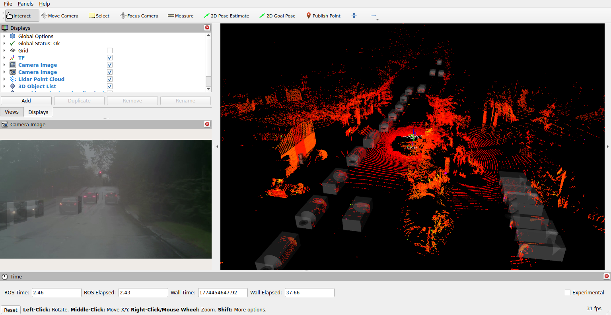
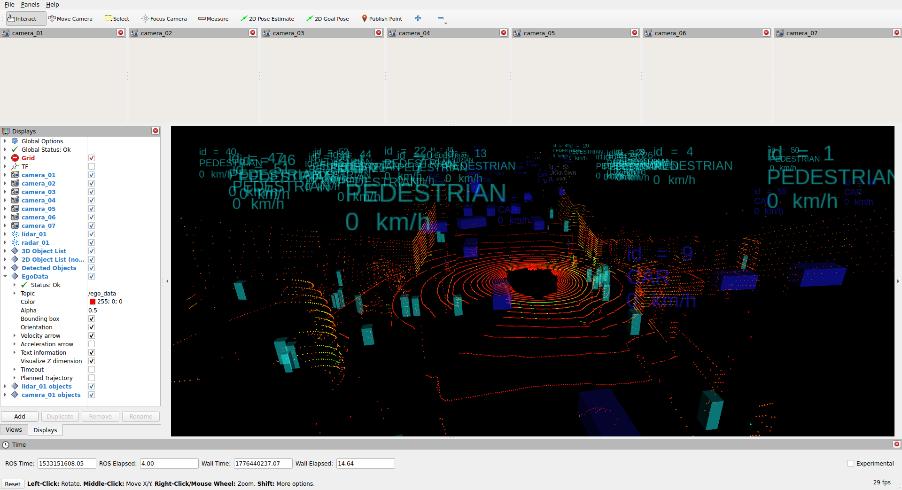
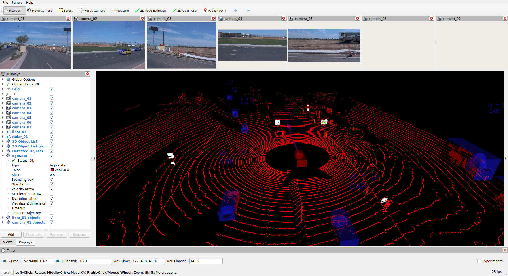

# Implementation Details

## Usage

The `autonomy_datasets` package is available in a pre-compiled Docker image. Start a container mounting your local dataset directory. Alternatively, use VS Code to open this repository in a Devcontainer.

> Follow the instructions in the [Supported Datasets](#supported-datasets) section to obtain the dataset.

```bash
DATASET_DIR="~/datasets"  # adapt this to your dataset location
docker run --rm -it --gpus all --env=DISPLAY --volume=/tmp/.X11-unix:/tmp/.X11-unix:rw --volume $DATASET_DIR:/datasets ghcr.io/thinking-cars/autonomy_datasets:latest bash
```

Run the following command in the container to visualize samples from the *NVIDIA PhysicalAI AV Dataset*:

```bash
hf auth login  # login with your HuggingFace access token
ros2 launch autonomy_datasets autonomy_datasets.launch.py rviz:=yes
```

This will download all selected scenes sequentially, write samples into Rosbags at `$DATASET_DIR/nvidia_physicalai_av_dataset/bags` while visualizing samples in Rviz.

The following command will only write samples to rosbags without publishing as ROS messages:

```bash
ros2 launch autonomy_datasets autonomy_datasets.launch.py publish_samples:=false
```


## Supported Datasets

This repository supports various automated driving datasets including:
- [**NVIDIA PhysicalAI AV Dataset**](#nvidia-physicalai-av-dataset)
- [**nuScenes**](#nuscenes-dataset)
- [**Waymo Open Dataset**](#waymo-open-dataset)
- [**Thinking Cars Datasets**](#thinking-cars-dataset) available on request for **commercial use and custom data**
- [**Contributions**](#adding-a-new-dataset) adding more open datasets are welcome


### NVIDIA PhysicalAI AV Dataset

[](https://huggingface.co/datasets/nvidia/PhysicalAI-Autonomous-Vehicles)
[](https://huggingface.co/datasets/nvidia/PhysicalAI-Autonomous-Vehicles)



The number of samples depends on the configurable selected sensor modalities:

| Sensor Modalities | Sensor Setup | Samples |
| ------ | ------ | ---- |
| **Camera** | 7 cameras at 30 Hz | 306.152 (20 seconds each) | 183.691.200 |
| **Camera + Lidar** | 7 cameras + 360 deg lidar at 10 Hz | 298.326 (20 seconds each) | 59.665.200 |
| **Camera + Radar** | 7 camera + up to 10 radars at 10 Hz | 160.761 (20 seconds each) | 32.152.200 |
| **Camera + Lidar + Radar** | 7 camera + 360 deg lidar at 10 Hz + up to 10 radars at 10 Hz | TODO (20 seconds each) | TODO |

The provided **default splits** contain only samples including all sensor modalities (**Camera + Lidar + Radar**).

| Split | Country | Scenes | Samples |
| ----- | ------- | ------ | ---- |
| `all` | All | 85.082 | approx. 17.016.400 |
| `all` | Germany | 7.247 | approx. 1.449.400 |
| `train` | Germany | 3.694 | approx. 738.800 |
| `valid` | Germany | 2.044 | approx. 408.800 |
| `test` | Germany | 1.509 | approx. 301.800 |

#### Usage

Login using your [HuggingFace Token](https://huggingface.co/docs/hub/security-tokens) to access the dataset and run the ROS node to download and store the data to rosbags while visualizing it in Rviz.

```bash
hf auth login
ros2 launch autonomy_datasets autonomy_datasets.launch.py dataset:=nvidia_physicalai_av_dataset
```


### nuScenes Dataset

[](https://www.nuscenes.org/terms-of-use)
[](https://www.nuscenes.org/nuscenes)



| Split | Samples |
| ------ | ------ |
| `training` | 28.130 |
| `validation` | 6.019 |
| `training_mini` | 25 |
| `validation_mini` | 17 |

| Source | Topic | Type | Description |
| ----- | ----- | ----- |---------- |
| Sensor: Lidar | `/autonomy_datasets/point_cloud` | `sensor_msgs/PointCloud2` | Raw sensor data from top lidar as point cloud with fields (`x`, `y`, `z`, ...). |
| Sensor: Front Camera | `/autonomy_datasets/camera/image_raw` | `sensor_msgs/Image` | Raw RGB images (height=900px, width=1600px) from front camera. |
| Annotation: 3D Objects | `/autonomy_datasets/object_list_3d` | `perception_msgs/ObjectList` | Annotated 3D objects in HEXAMOTION model. |

#### Usage

[Download](https://www.nuscenes.org/nuscenes#download) the dataset and ensure the following folder structure is correct:

```bash
$DATASET_DIR/
    nuscenes/
        basemap/
            *.png
        ...
        samples/
            CAM_BACK/
                *.jpg
            ...
        sweeps/
            CAM_BACK/
                *.jpg
            ...
        v1.0-mini/
            *.json
        v1.0-test/
            *.json
        v1.0-trainval/
            *.json
```

Run the ROS node to convert and store the data to rosbags while visualizing it in Rviz.

```bash
ros2 launch autonomy_datasets autonomy_datasets.launch.py dataset:=nuscenes
```


### Waymo Open Dataset

[](https://waymo.com/open/terms)
[](https://waymo.com/open)



| Split | Samples |
| ------ | ------ |
| `all` | 198.068 |
| `training` | 158.081 |
| `validation` | 39.987 |

| Source | Topic | Type | Description |
| ----- | ----- | ----- |---------- |
| Sensor: Lidar | `/autonomy_datasets/point_cloud` | `sensor_msgs/PointCloud2` | Raw sensor data from top lidar as point cloud with fields (`x`, `y`, `z`, `intensity`, `elongation`) in `lidar_top` frame. |
| Annotation: 3D Lidar Objects | `/autonomy_datasets/object_list_3d` | `perception_msgs/ObjectList` | Annotated 3D objects (HEXAMOTION model) in `base_link` frame. Default: Only objects with min. 1 point in top lidar point cloud. |
| Sensor: Front Camera | `/autonomy_datasets/camera/image_raw` | `sensor_msgs/Image` | Raw RGB images (height=1280px, width=1920px) from front camera. |
| Annotation: 2D Camera Objects | `/autonomy_datasets/object_list_2d` | `perception_msgs/ObjectList` | Annotated 2D objects (CAMERA_2D model) in `cam_front` frame. |

#### Usage

[Download](https://waymo.com/open/) the dataset and ensure the following folder structure is correct:

```bash
$DATASET_DIR/
    waymo_open_dataset/
        training/
            camera_box/
                *.parquet
                ...
            ...
        validation/
            camera_box/
                *.parquet
                ...
            ...
```

Run the ROS node to convert and store the data to rosbags while visualizing it in Rviz.

```bash
ros2 launch autonomy_datasets autonomy_datasets.launch.py dataset:=waymo_open_dataset
```


### Thinking Cars Dataset


[](https://thinking-cars.de/)

**Custom datasets** according to your needs and suitable for **commercial use** are available via an expanding network of partners [on request](mailto:info@thinking-cars.de), for example:

- Sensor data from (stereo) cameras, lidars, radars and IMU
- Object annotations
- V2X Data (e.g. [ETSI ITS Messages](https://forge.etsi.org/rep/ITS/asn1))
- Driving Trajectories and Scenarios

### Adding a new dataset

1. Create a new dataset adapter based on the existing files [here](../autonomy_datasets/autonomy_datasets/datasets/).
2. Add documentation for the new dataset to this README and add it to the table in the [top-level README](../README.md).
3. Create a [Pull Request](https://github.com/thinking-cars/autonomy_datasets/pulls) on GitHub and wait for maintainer's feedback.
